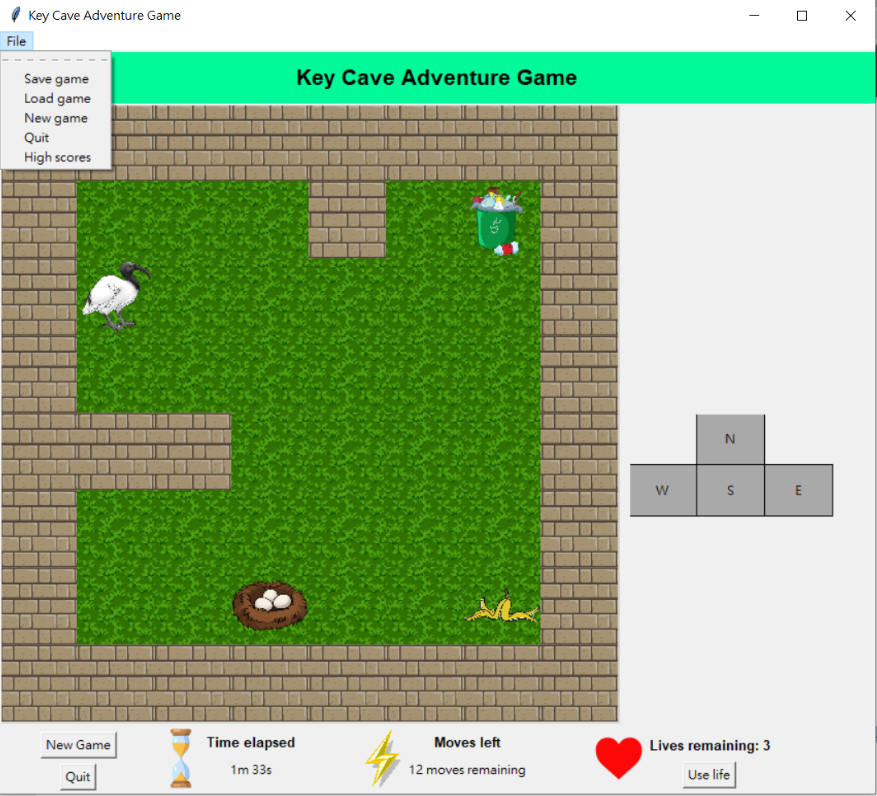

# Key_Cave_Adventure_Game
A single-player dungeon-crawler game.

The objective is for the ibis to find the trash and get back to its nest.

Players can move their character by pressing the keypad(WASD) or press the build-in buttons.

Ibis can have extra moves by eating banana, and can go back to its prior position by using life.

Players can save, load, restart, and get high scores in the menu.

